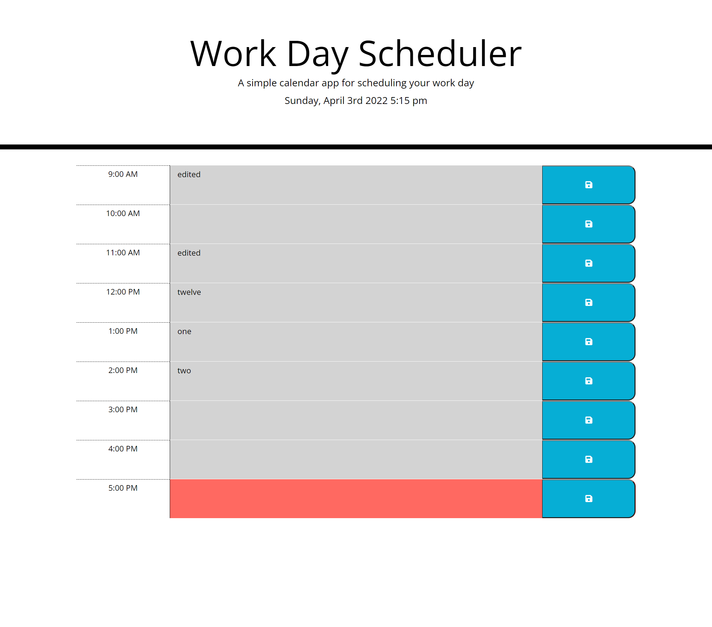

# work-day-scheduler
## Description
A simple single-day planner to keep your day organized. The schedule saves to localStorage to keep your plans after refreshing the page. Time blocks change color to show which part of the schedule is for the current hour, is in the past, and is in the future.

## Screenshot

## Deployed Page
https://michaelsamm.github.io/work-day-scheduler/